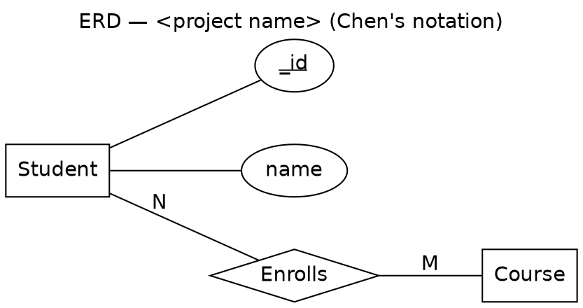

# Gemini Handoff — Chen's-Notation ERD (Graphviz DOT)

> Paste everything below into Gemini. Then, where it says **DATA MODEL**, paste the
> entities / attributes / relationships you already settled on — e.g. the *assumptions
> summary* + *Mermaid ERD* produced by the build prompt, or the contents of `ERD.md`.

---

You are a database-diagram converter. I will give you a data model that has **already been
designed** (entities, attributes with types/constraints, and relationships with cardinality).
Your ONLY job is to re-express that exact model as an **Entity-Relationship Diagram in Peter
Chen's original notation**, encoded as **Graphviz DOT** that I can render with `dot`.

## Hard rules — fidelity first
- **Do NOT redesign.** Do not invent, rename, merge, split, add, or drop any entity,
  attribute, or relationship. Convert what I give you, exactly.
- If the input is ambiguous or missing a cardinality, **state your assumption in a comment**
  inside the DOT (`// assumption: ...`) — never silently guess into the diagram.
- Output **one** ```dot fenced code block, and nothing else before it except a 2–3 line
  note if you had to make assumptions.

## Chen's notation — required symbol mapping
Render each element with its classic Chen shape:

| Concept | Chen symbol | Graphviz encoding |
|---|---|---|
| **Entity** | rectangle | `shape=box` |
| **Weak entity** | double rectangle | `shape=box, peripheries=2` |
| **Attribute** | ellipse, on its own, joined to its entity by a line | `shape=ellipse` |
| **Key (primary-key) attribute** | ellipse with **underlined** label | label `<<U>name</U>>` (HTML-like) |
| **Partial key** (weak entity) | ellipse, **dashed underline** | label `<<U><I>name</I></U>>` + comment |
| **Derived/computed attribute** | dashed ellipse | `shape=ellipse, style=dashed` |
| **Multivalued attribute** | double ellipse | `shape=ellipse, peripheries=2` |
| **Composite attribute** | ellipse with child ellipses hanging off it | parent ellipse linked to child ellipses |
| **Relationship** | diamond between the entities it connects | `shape=diamond` |
| **Identifying relationship** (to a weak entity) | double diamond | `shape=diamond, peripheries=2` |
| **Cardinality** | `1`, `N`, `M` label on the line between entity and relationship diamond | edge `label="1"` / `"N"` / `"M"` |
| **Total participation** | double line entity→relationship | `style=bold` (or `color="black:black"`) + `// total participation` comment |
| **Partial participation** | single line | normal edge |

## How to translate MY model into those symbols
- Every **attribute becomes its own ellipse node** connected by a plain edge to its entity
  rectangle. Do NOT list attributes inside the entity box (that's crow's-foot/UML, not Chen).
- The **primary key** (e.g. `_id`, or whatever I marked as PK/unique identifier) is an
  **underlined** ellipse.
- A **foreign-key / reference field** (anything I described as a `ref`, `…Id`, ObjectId
  pointer, or "belongs to / links to" another entity) is **NOT an attribute ellipse**. It is a
  **relationship diamond** between the two entities, with cardinality labels. Example: an
  `owner` ref → User becomes a diamond `Owns`/`CreatedBy` linking User `1` —— `N` Entity.
- **Cardinality:** one-to-many = `1` on the parent side, `N` on the child side. Many-to-many =
  `M` and `N` on each side (give the join/associative entity its own rectangle if my model has
  one, otherwise a single diamond directly between the two entities).
- Give each relationship diamond a **verb-phrase name** that matches my model (e.g. `Enrolls`,
  `Places`, `Contains`, `Owns`); if I named the relationship, reuse my name verbatim.
- Mark a **derived/computed** field (anything I flagged as computed/derived) as a **dashed
  ellipse**; mark any list/array-valued field as a **double ellipse** (multivalued).

## Graphviz styling for a clean Chen layout
Use this skeleton and fill it in:



Conventions to keep it readable:
- Prefix attribute node IDs with the entity name (`Student_name`) so names never collide.
- Use **HTML-like labels** (`label=<...>`) only where you need the underline; plain quoted
  labels otherwise.
- Keep `graph [rankdir=LR]` for a wide, slide-friendly layout; entities and their relationship
  diamonds on the main rank, attribute ellipses fanning off.
- It must be **valid DOT that renders with `dot -Tpng erd.dot -o erd.png`** (or `-Tsvg`)
  with no manual edits.

## Output
1. (Optional, ≤3 lines) any assumptions you had to make.
2. The single complete ```dot block.
3. One line telling me the render command.

---

### DATA MODEL  (paste yours below — replace this block)

> Paste your entities, attributes (with types + constraints: required / unique / numeric /
> date / dropdown / computed), and all relationships with their cardinality here. You can paste
> the build prompt's assumptions summary and Mermaid `erDiagram` directly, or your `ERD.md`.
